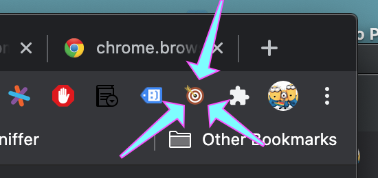
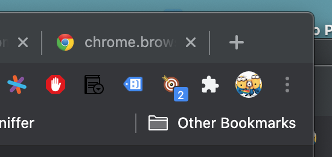

# Find My Meeting

Has this ever happened to you?! You're using Google Meet™ with Google Chrome™ and you switch to another window and... you can't... just **can't** find your active meeting tab anymore! It's lost in a sea of browser windows and tabs!

Sure, you can look for the little "tab is using the camera or microphone" indicator... but what if you have dozens of windows, each with dozens of tabs?! How frustrating! How unprofessional! How embarrassing!

But wait! This extension provides a simple solution to your "lost meeting" woes! Just click on its icon and **all** tabs open to a [meet.google.com](https://meet.google.com) URL will be activated and focused to the foreground!

If you're a wee bit crazy and have **more** than one Google Meet™ tab open, a little badge will temporarily appear to tell you just how many Google Meet™ tabs were found, activated and focused!

No more looking like a goofball during your meeting as you furiously hunt through browser windows and tabs... just click on `Find My Meeting` and be done with it!

## Privacy Policy

This extension doesn't store nor transmit any data whatsoever at any time, period![*](#footnote)

### Bugs

There are _way_ too many exclamation marks in the [README](README.md)!

### See Also

[Find My Mail](https://github.com/adfernandes/find-my-meeting/tree/find-my-mail) and [Find My Calendar](https://github.com/adfernandes/find-my-meeting/tree/find-my-calendar)!

-----

<a name="footnote">*</a>Note, however, that the [Chrome Web Store for Browser Extensions](https://chrome.google.com/webstore/category/extensions) probably collects _lots_ of information about you as per [Google's Chrome Web Store privacy policy](https://policies.google.com/privacy)! But that's Google™ and not me!
